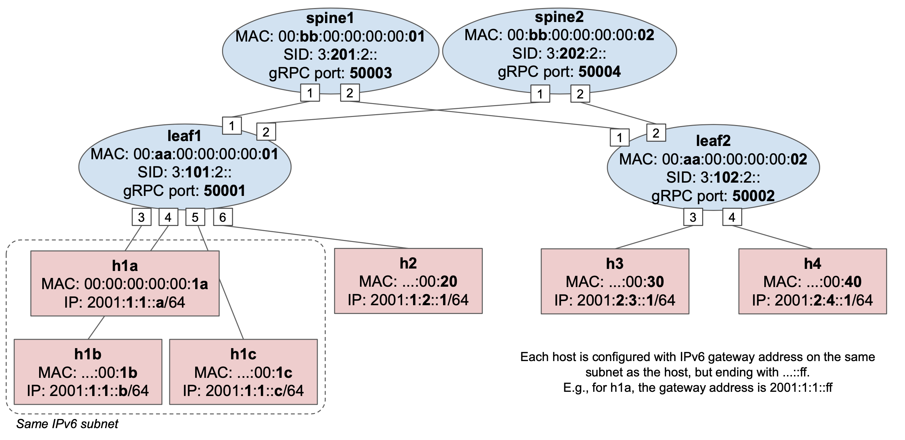

# SDN SRv6 Controller
Original network scenario can be found [here](https://github.com/opennetworkinglab/ngsdn-tutorial/blob/advanced/EXERCISE-6.md)

This network scenario has been adapted for Kathara Dockers, but the SDN has been switched with and ROSE solution that is described [here](https://netgroup.github.io/srv6-sdn/).

NOTE:
The instructions on how to modify Kathara Docker images needed to run this network are not ready yet.

## Network Scenario

This is the network scenario topology: 

